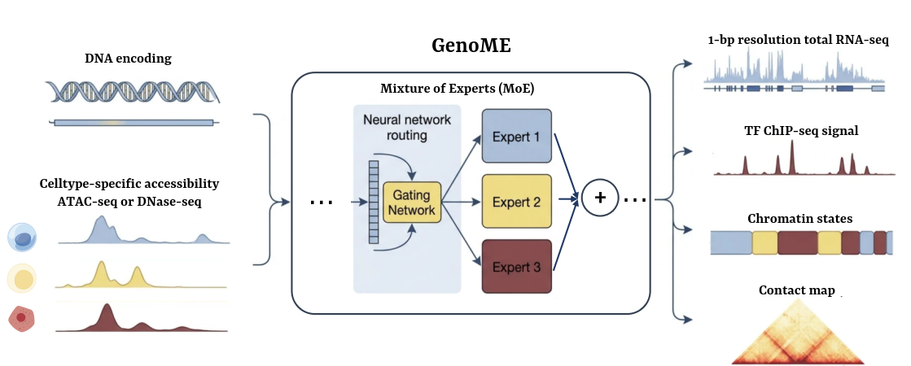

# GenoME

GenoME is a Mixture of Experts (MoE)-based generative model that integrates DNA sequence and cell-type-specific chromatin accessibility (ATAC-seq/DNase-seq) to predict a unified genomic profile across multiple scales and modalities. It enables individualized, multimodal prediction and perturbation of genomic profiles.

**Paper**: [bioRxiv Preprint](https://www.biorxiv.org/content/10.64898/2025.12.28.696482v1/) | **Demo Data**: [Data link](docs/)



## Key Features
- **Multi-modal Prediction**: Multimodal prediction of epigenomics, transcriptomics, and 3D chromatin architecture at base-pair to kilobase resolutions
- **Cross-Cell Generalization**: Cross-cell-type generalization to predict full regulatory landscapes for unseen or individualized cell types
- **Perturbation Analysis**: In silico perturbation analysis for simulating genetic and epigenetic perturbations and identifying functional regulatory connections

## Installation

### Quick install 
- The simplest way to set up the environment is using the provided `environment.yml` file.
   ```bash
   git clone https://github.com/JWei2015/GenoME.git
   cd GenoME
   conda env create -f environment.yml
   conda activate py310  
   pip install -e .

### Step‑by‑step manual installation
If the quick install does not work (e.g., due to dependency conflicts), follow these steps:
1. Clone the repository
   ```bash
   git clone https://github.com/JWei2015/GenoME.git
   cd GenoME
2. Create a fresh conda environment
Python>=3.10 is required; setuptools < 82.0.0 to avoid code conflicts.
   ```bash
   conda create -n py310 python==3.10.20 setuptools==80.9.0
   conda activate py310
3. Install core dependencies
   ```bash
   conda install mamba==2.5.0
   mamba install pytorch==2.10.0
   mamba install mamba-ssm==2.3.0 fsspec==2026.2.0
   pip install cooltools
   mamba install cooler
   pip install pytorch-lightning==1.9.5 lightning-bolts==0.7.0 torch==2.10.0
   mamba install kipoiseq
   mamba install pybigwig

### Data Preparation
1. Input Formats:
- DNA sequence: FASTA format (hg38 reference genome)
- ATAC-seq/DNase-seq: BAM format (base-pair resolution)
- Training targets: BigWig files for RNA-seq, ChIP-seq; cooler format for Hi-C
2. Data preprocessing：
see **Paper**:  [BioRxiv Preprint](https://www.biorxiv.org/) 


